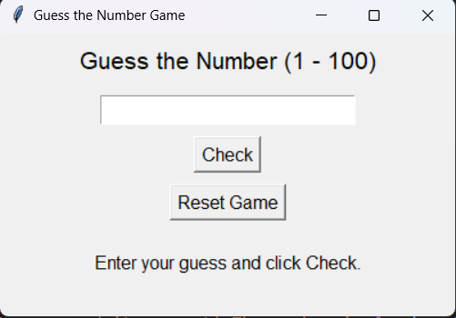
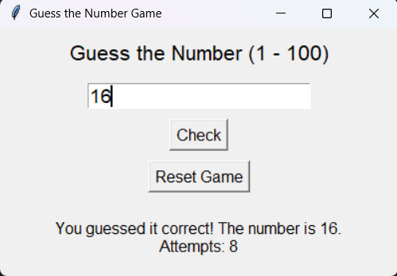

# 🎯 Guess the Number Game (GUI Version)

A graphical **Guess the Number** game built using **Python and Tkinter**.

In this game, the computer randomly selects a number between **1 and 100**, and the player attempts to guess it. After each guess, the program provides hints ("Higher" or "Lower") until the correct number is guessed.

---

## 🚀 Features

* 🖥️ Interactive GUI using Tkinter
* 🎲 Random number generation
* 📈 Higher / Lower hints
* 🔢 Attempt counter tracking
* 🔄 Reset game functionality
* ⚠️ Input validation with exception handling

---

## 🛠️ Technologies Used

* Python 3
* Tkinter (Built-in GUI Library)
* random module

---

## 📂 Project Structure

```
guess-the-number-gui/
│
├── src/
│   └── guess_the_number.py
│
├── README.md
├── .gitignore
└── requirements.txt
```

---

## ▶️ How to Run the Project

1. Clone the repository:

```bash
git clone https://github.com/your-username/guess-the-number-gui.git
```

2. Navigate to the project folder:

```bash
cd guess-the-number-gui/src
```

3. Run the program:

```bash
python guess_the_number.py
```

Make sure Python 3 is installed on your system.

---
## Preview
<p align="center">
  
  
</p>
## 📚 Concepts Practiced

* Functions and global variables
* Conditional statements (`if-elif-else`)
* Exception handling (`try-except`)
* Random number generation
* GUI development with Tkinter
* Event-driven programming

---

## 💡 Future Improvements

* Add difficulty levels (Easy / Medium / Hard)
* Add score history
* Add timer feature
* Convert into executable (.exe) file

---

## 👨‍💻 Author

**Souvik Banerjee**
CSE Student | Python Developer | Exploring GUI Development
